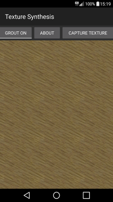

# texture-synthesis-android
Texture Synthesis Android App using resynthesizer

This project combines [notwa/resynth](https://github.com/notwa/resynth) with [barryoneill/TiledBitmapView](https://github.com/barryoneill/TiledBitmapView) to allow texture synthesis on mobile devices.

The app is available from the app store for free [here](https://play.google.com/store/apps/details?id=net.martaskolda.meep.tbv.texture).

The texture synthesis algorithm that's used is Resynthesizer (http://www.logarithmic.net/pfh/thesis), because it came out as the highest-quality fast method according to [my study](https://github.com/mrmartin/ordering_study).
